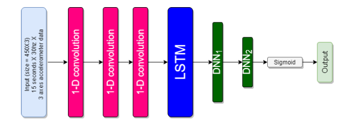
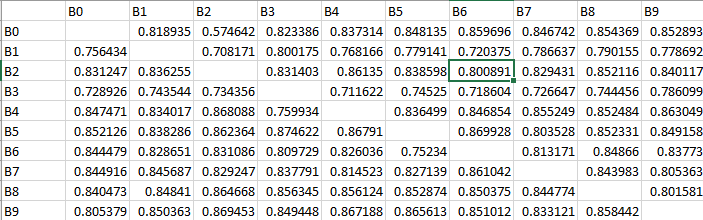

# CHORES-Analyses
<br />
We used CNN-LSTM models to perform two different taks. Task one has three subtasks, binary classification of acceleromter data whether the sample
is sedentary, lifesyle and locomotion. Task two to estimate the MET value of the activity.we collected data from 141 participants doing 31 typical daily activitles. The data is collected Actigraph GT3X+ triaxial
accelerometer). The raw data downsampled to 30 hz to be consistent for all the participants. The data is split into 15 second
samples therfore every sample has a shape (450,3). This raw sample is provided as input the deep nueral network to perform activity
classifcation and MET regression.   


<p align="center">
  Schematic of Neural Network
  
</p>

## Requirements
To run the code:

* python 3.5+
* numpy
* keras with tensorflow backend
* scipy
* sklearn
* json
* glob
* os
* shuttle
* matplotlib
* random

## Run the Models
 The repository two python files run.py and run_mets.py to run classification and regressiont task respectively.   
  ### For classification   
  Instatiate the class ```ActivityRecognition``` from run.py. The '''__init__''' method of class takes the task argument
  and whether to learned neural network weights. Task can only be one of the three 'sedentary','locomotion','lifestyle'. 
  
  ```
  from run import ActivityRecogniton
  object = ActivityRecognition(task='sedentary',save_weights=True)
  object.looprun()
  ```
  The data from 141 participants is split into 10 batches. '''looprun''' method of ```ActivityRecognition``` trains the network 
  for all the 10 batches individually and saves the weights.    
  
  The script creates the following folders:   
  metrics : contains files corresponding to precision, recall, sesitivity, f1-score.  example: 'sedentary_f1-score.csv'   
  weights : contains wegihts of each model. example: 'sedentary_2_5.h5' 2 is the test batch id and 5 is the validation batch id.   
  history : keras training history is saved in this folder for each run   
  plots : loss and accuracy plots are generated and stored   
  All the files generated with have the task in the name, test batch id and validation batch id.    
  
  #### Understanding the metrics file
  <p align="center">
  
  </p>
  <br />
  The above image shows 'sedentary_f1-score.csv'. Every [i,j] th entry corresponds to models f1-score when batch 'i' is the test set, batch
  'j' is the validations set and all the other batches are part of training set. The highlighted number '0.800891' is the f1-score performace 
   of the model when the test set is batch 2, validation set is batch 6 and rest 8 batches are training set.   
   ### For METs estimation
   Instatiate the class ```MetEstimation``` from run_mets.py. 
   
  ```
  from run_mets import MetEstimation
  object = MetEstimation()
  object.looprun()
  ```
  MET estimation is regression task. We used the same model architecture as classification task but got rid of the sigmoid 
  actionvation in the last layer. The run saves the weigths, history, plots and metrics. We only used the root means squrare
  error (RMSE) metric for the METS estimation.
  
   
   
   

  
